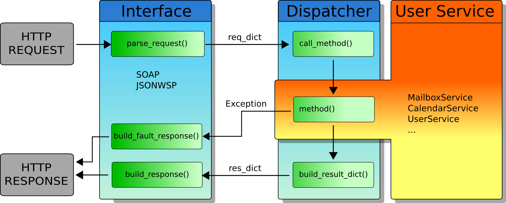
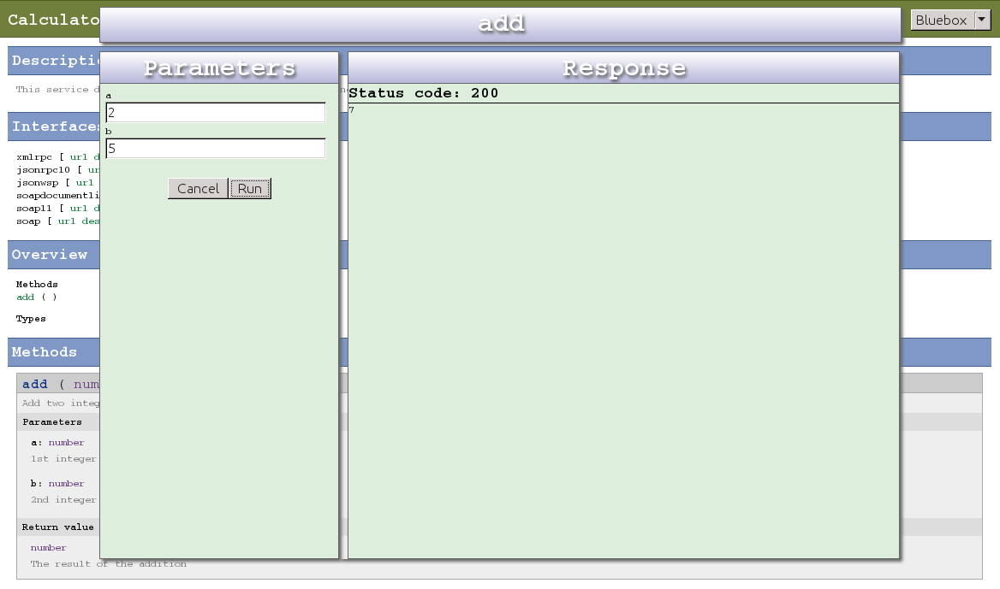

.. Ladon documentation master file, created by
   sphinx-quickstart on Thu Feb  3 00:18:00 2011.
   You can adapt this file completely to your liking, but it should at least
   contain the root `toctree` directive.

Welcome to Ladon's documentation!
=================================

Introduction
------------

Ladon is a multi-protocol web service framework. Take your user functionality
and wrap it into a plain python class which we call a Ladon service class.

You control which methods to expose by applying a certain decorator called ladonize.
When a method is ladonized you define the parameter types for the method. This way
it's possible to for the Ladon framework to generate description files for different
web service protocols (ie. WSDL for SOAP or jsonwsp/description for JSON-WSP)

When your service class is in place, serve it up using Ladons build-in server or
using the WSGI Wrapper application for real webservers.

A basic ladon service consists at least of two modules: 
  1. The service itself
  2. A WSGI application handler

Take a look at :ref:`ex-1` and :ref:`ex-2` below to get an idea of how it works.

Links of interrest
------------------

.. image:: https://bytebucket.org/jakobsg/ladon/raw/master/docs/source/images/www.png
   :target: http://ladonize.org

.. image:: https://bytebucket.org/jakobsg/ladon/raw/master/docs/source/images/bitbucket.png
   :target: https://bitbucket.org/jakobsg/ladon

.. image:: https://bytebucket.org/jakobsg/ladon/raw/master/docs/source/images/youtube.png
   :target: http://www.youtube.com/playlist?list=PLFD1020FE0CB288FC

Feature requests
----------------
Need a fast-pace feature implementation? Go to: http://ladonize.org/index.php/FeatureRequest

Table of contents
-----------------
   
.. toctree::
   :maxdepth: 3

   ladonize.rst
   ladontype.rst
   tasks.rst
   extending.rst

.. _ex-1:

Example 1
---------

The first example is the simplest service I could imagine, taking to integers as argument and adding them together
to return the addition as the method result.

Notice the ladonize decorator that defines the parameter types and the return type.
This is really all you need to do to expose your method.

calculator.py::

	from ladon.ladonizer import ladonize

	class Calculator(object):

		@ladonize(int,int,rtype=int)
		def add(self,a,b):
			return a+b

Test run
~~~~~~~~
now test the service by using the ladon-X.Y-ctl script that is installed with the Ladon package, where X.Y
should be replaced with the major/minor version of the Python version you are running. For instanse if you
have installed Ladon for Python 2.7, you should run the following command to test your service::

	ladon-2.7-ctl testserve calculator.py -p 8080

To test that your service is running properly try putting the following into the address line of a browser,

1. http://localhost:8080/Calculator/soap/description
2. http://localhost:8080/Calculator/jsonwsp/description

or use curl::

	curl http://localhost:8080/Calculator/soap/description
	curl http://localhost:8080/Calculator/jsonwsp/description

Test call
~~~~~~~~~
To try out your service the easiest way is to start a browser and go to the service's online API browser which is an integrated feature in Ladon,

* http://localhost:8080

You will see the service catalog which links to all the service classes you have exposed at this HTTP entry point. 

* Select "Calculator"
* Select the "bluebox" skin top-right (if not already selected)
* Under the "Methods" section find the "add" method and click it. This should present a dialog for calling the method.
* Enter some values and click "Run"

.. note::
   - Using a browser with "bluebox" skin will call your service using the JSON-WSP protocol exclusively.
   
   - It is recommended that you use fiddler, firebug or the browser's built-in web developer tools to
     study the request/response flow.
   
   
You can also use curl again or any other tool that can post a request to your service.
choose your favourite interface and create the post data. Let's try with Ladon's jsonwsp:

add-jsonwsp.req::

	{"methodname": "add", "args": {"a":19, "b":34}}

send the request to the Calculator service::

	curl --data "@add-jsonwsp.req" http://localhost:8080/Calculator/jsonwsp --header "Content-Type: text/javascript; charset=utf-8"

The service should return the result as JSON::

	{"servicename": "Calculator", "servicenumber": 1, "method": "add", "result": 53}

.. _ex-2:

Example 2
---------

The second example is a bit more elaborate and shows how you can implement a web service with lists and nested types.

userservice.py::

	from ladon.ladonizer import ladonize
	from ladon.types.ladontype import LadonType

	class User(LadonType):
		name = unicode
		age = int
		groups = [ unicode ]

	class ListUsersResponse(LadonType):
		success = bool
		users = [ User ]

	class UserService(object):

		@ladonize(unicode,rtype=ListUsersResponse)
		def listUsers(self,uid):

			user1 = User()
			user1.name = u"John Doe"
			user1.age = 30
			user1.groups = [ u'admin', u'www-data' ]

			user2 = User()
			user2.name = u"John Deer"
			user2.age = 60
			user2.groups = [ u'farming', u'tractor' ]

			result = ListUsersResponse()
			result.success = True
			result.users = [ user1, user2 ]

			return result

Creating a handler for Apache2/mod_wsgi is actually simpler that writing the standalone version. Setup your Apache site
which could maybe contain the following directive::

	WSGIScriptAlias / /srv/www/userservice/handler.py

Now create your handler:

handler.py::

	from ladon.server.wsgi import LadonWSGIApplication
	application = LadonWSGIApplication(['userservice'],['/path/to/userservice'])

Indices and tables
==================

* :ref:`genindex`
* :ref:`modindex`
* :ref:`search`

